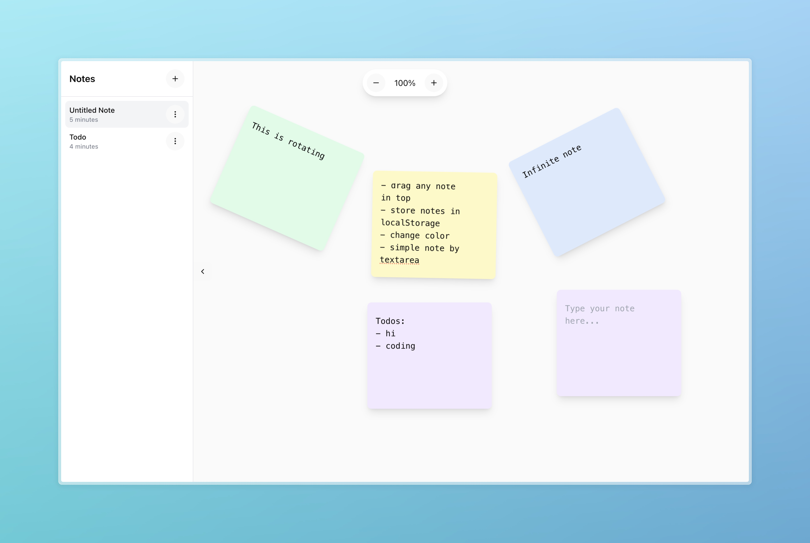

# Infinite Canvas Notes

一个基于无限画布的笔记应用，让你的思维可以自由延展。

⚠️ 目前还在开发中，很多功能还不完善，欢迎一起参与开发！

## ✨ 特性

- 🎨 无限画布 - 自由拖拽、缩放的无边界空间
- 📝 富文本编辑 - 支持 Markdown 语法和多媒体内容
- 🔗 双向链接 - 轻松建立笔记之间的关联
- 🎯 思维导图 - 可视化你的思维结构
- 🔍 全文检索 - 快速定位任何内容
- 💾 自动保存 - 实时同步，永不丢失
- 📱 响应式设计 - 完美适配各种设备



## 已实现

- 🎨 无限画布 - 自由拖拽、缩放的无边界空间
- 📝 文本编辑 - 基于 Textarea 的文本编辑


## 🚀 快速开始

```bash
克隆项目
git clone https://github.com/zysam/infinite-canvas-notes.git
安装依赖
cd infinite-canvas-notes
npm install
启动开发服务器
npm run dev
```
## 🛠️ 技术栈

- React + TypeScript
- Tailwind CSS
- Shadcn UI
- Radix UI
- Framer Motion

## 📖 使用文档

TBD

## 🤝 贡献指南

欢迎提交 Issue 和 Pull Request！

1. Fork 本仓库
2. 创建特性分支 (`git checkout -b feature/AmazingFeature`)
3. 提交更改 (`git commit -m 'Add some AmazingFeature'`)
4. 推送到分支 (`git push origin feature/AmazingFeature`)
5. 开启 Pull Request

## 📄 开源协议

本项目采用 MIT 协议 - 查看 [LICENSE](LICENSE) 文件了解详情

## 👥 团队

- 开发者名字 - [GitHub](https://github.com/zysam)
